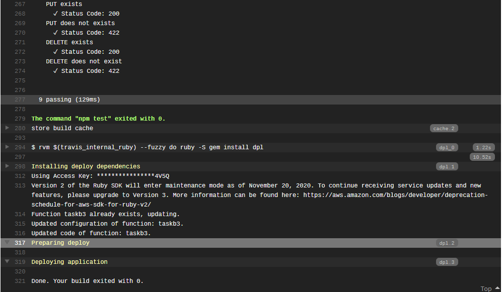

# CS3219 Task B

[](https://travis-ci.org/ryanYtan/cs3219-B-restAPI)

## Pre-requisites
* MongoDB: DBMS
* Postman: To manually serve API requests
* Node: Back-end framework

## Set-up
1. In a shell, run `mongod` and leave it running
2. In another shell, clone the repo and `cd` into the directory
3. Run `npm install` to install node dependencies
4. Run `nodemon` or `node index.js` to start the server
5. You can access the server at `localhost:8080`

## Task B1 - RESTful API
After running the server, you can use Postman to test REST calls. The supported
REST calls are:

* `GET     /api/persons`
* `GET     /api/persons/{username}`
* `POST    /api/persons`
* `PUT     /api/persons/{username}`
* `DELETE  /api/persons/{username}`

The body of a `POST` or `PUT` request should have the followed key-value pairs,
with the `content-type` being `x-www-form-urlencoded`.

```json
{
    userName:   {user_name} // alphanumeric, no spaces
    firstName:  John
    lastName:   Doe
    email:      johndoe@example.com
    phone:      12345678
}
```

An example Postman session for `POST` request is shown below


## Task B2 - API Test Cases and Travis CI/CD
The test cases are found in `$PROJECT_DIR/tests/test.js`. They can be run
via `npm run test`.

Travis settings can be found in `.travis.yml`, and the automatic CI/CD can be
seen from the checkmark next to the commit hash above.

## Task B3 - Automatic deployment to Serverless
Automatic deployment to serverless (AWS Lambda) is done via Travis. The settings can be
found in `serverless.yml`, `.travis.yml` and `index.js`. The remote database
used is Atlas from MongoDB.

This [link](https://travis-ci.org/github/ryanYtan/cs3219-B-restAPI/builds/741715559#L317)
shows a Travis build that automatically deploys to AWS Lambda.

Below is a screenshot, line 317 and 319 are of concern to this task.



## Task B4
Task B4 uses B2 as the "starting ground", and can be found in branch `task-b4`.
Relevant instructions can be found under the README for that branch.
