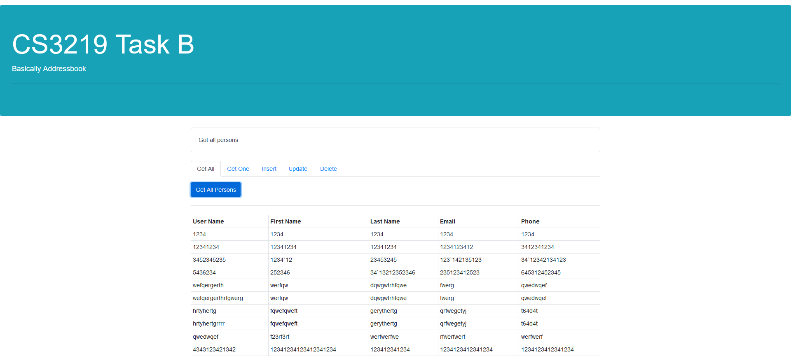

# CS3219 Task B

## Pre-requisites
* MongoDB: DBMS
* Postman: To manually serve API requests
* Node: Back-end framework

## Set-up
1. In a shell, run `mongod` and leave it running
2. In another shell, clone the repo and `cd` into the directory
3. Run `npm install` to install node dependencies
4. Run `nodemon` or `node index.js` to start the server routes
5. You can access the API at `localhost:8081`
6. `cd` into `website`
7. You may need to run `npm install` again to install the front-end dependencies
8. Access the website at `localhost:8080`.

## Task B4
The website is created in Vue.js, styled with Bootstrap, supported by a local DB.

